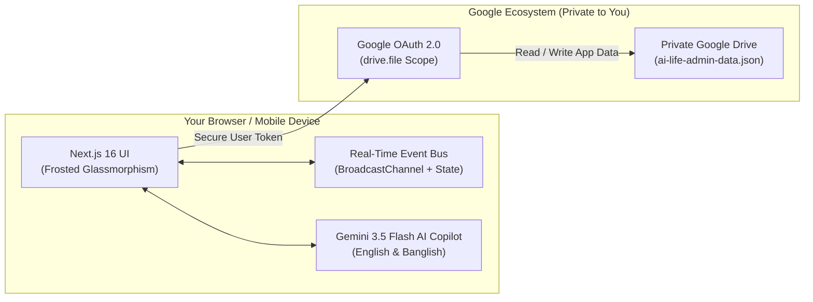

# 🌌 AI Life Admin — Personal Finance & Life Copilot

<div align="center">


<p align="center">
  <b>A privacy-first, intelligent personal life administration & financial copilot powered by Google Gemini.</b><br>
  Persistent memory, multi-wallet liquidity tracking, bilingual natural language accounting (English & Banglish), and predictive purchase stress-testing — with 100% data ownership hosted directly in your private Google Drive.
</p>

[Key Features](#-key-features) •
[Architecture](#-architecture--privacy-model) •
[Bilingual AI Copilot](#-bilingual-ai-copilot-english--banglish) •
[Installation](#-getting-started) •
[Screenshots](#-preview--design-system) •
[Tech Stack](#-tech-stack)

</div>

---

## 💡 Overview

Managing modern life administration across scattered bank accounts, mobile financial services (bKash, Nagad), cash reserves, loans, subscriptions, and recurring commitments is fragmented and mentally taxing. Most personal finance tools either sell your data, lock your financial ledger in proprietary servers, or require tedious manual data entry.

**AI Life Admin** solves this by uniting **executive-level financial orchestration** with **private cloud storage**:
- **Zero-Knowledge Data Privacy**: Your financial records never sit on an unauthorized third-party database. All transactions, wallets, and debts are encrypted and saved straight to your personal **Google Drive** (`ai-life-admin-data.json`).
- **Intelligent Memory-Aware Copilot**: Add transactions, resolve complex follow-up questions using pronouns ("How much is in it?"), memorize personal rules, and execute tools using natural speech in **English** or **Banglish**.
- **Real-Time Cross-Device Synchronization**: Zero-reload updates across multiple browser tabs, smartphones, tablets, and desktops using a unified event bus.

---

## ✨ Key Features

### 1. 📊 Executive Liquidity Cockpit (`/`)
- **Real-Time Net Worth & Reserves**: Live aggregation across liquid bank vaults, MFS accounts, cash, and investments.
- **Monthly Inflow vs. Burn Rate**: Real-time ratio analysis of earned income against variable spending.
- **AI Financial Diagnosis Modal**: Instant 1-click copilot audit analyzing cashflow health, liquidity runway, and urgent action items.
- **Recent Transaction Audit Log**: Filterable chronological feed of inflows, expenses, and inter-wallet fund transfers.

### 2. 💳 Multi-Wallet Liquidity Engine (`/money/wallets`)
- **Universal Wallet Support**: Track traditional Bank Accounts, Mobile Financial Services (bKash, Nagad, Upay, Rocket), Physical Cash, and Credit/Debit Cards.
- **Instant Inter-Wallet Transfers**: Move funds seamlessly between accounts with automated debit/credit balancing and timestamped transaction memos.
- **Zero-Leak Data Security**: When disconnected from Google Drive, defaults cleanly to a zero-state with zero demo-data contamination.

### 3. 🗓️ Monthly Planning & Calendar Matrix (`/money/planning`)
- **7-Day Dynamic Calendar Grid**: Visual matrix displaying upcoming daily financial obligations and payables.
- **Dual Perspectives**: Toggle between **Obligations** (*bills, loans due, subscriptions*) and **Daily Runway**.
- **Instant "Mark as Paid"**: Reconcile bills and payables with one tap, automatically logging the deduction to the selected source wallet.

### 4. 💸 Expense Burn Rate Manager (`/money/expenses`)
- **Executive Burn Cockpit**: Real-time monthly spend, daily burn velocity, top expenditure category, and AI classification coverage rate.
- **Visual Spending Distribution**: Interactive allocation bar mapping costs across Housing, Food & Dining, Utilities, Transport, Healthcare, and Shopping.
- **Screen-Centered Record Expense Modal**: Clean, frosted modal with instant AI category classification and automatic wallet deduction.

### 5. 💰 Income & Inflow Cockpit (`/money/income`)
- **Executive Inflow Metrics**: Track monthly earnings, all-time accumulated deposits, top revenue source, and recurring stream counters.
- **Dual View Modes**: Switch effortlessly between rich visual **Inflow Cards** and dense tabular **Inflow Sheets**.
- **Screen-Centered Record Income Modal**: Log salary, freelance stipends, investment returns, or gifts with direct wallet crediting.

### 6. 🤝 Loans & Debts Ledger (`/money/loans`)
- **Bidirectional Ledger**: Separate tracking for **Receivables** (*People Who Owe You*) and **Payables** (*Money You Owe Others*).
- **Executive Net Debt Position**: Luminous balance card displaying total amount lent vs. total amount borrowed.
- **Repayment Drawer**: Step-by-step settlement history, partial payment logging, due date tracking, and debt status progression (*Active*, *Partially Paid*, *Settled*).

### 7. 🧠 Purchase AI Decision Engine (`/insights/recommendations`)
- **Pre-Purchase Financial Stress Testing**: Evaluate discretionary purchases (*e.g., iPhone, MacBook, vacation*) before tapping your card.
- **Multi-Dimensional Risk Analysis**: Audits liquid reserves, checks 14-day upcoming obligations, calculates runway erosion, and flags savings goal cannibalization.
- **Executive Reasoning Chain**: Delivers an unambiguous verdict (*Safe to Buy*, *Caution / Delay*, *High Risk*) backed by structured AI reasoning.

### 8. 🎯 Goals & Runway Forecasting (`/goals`)
- **Target Savings Milestones**: Set specific financial milestones (*Emergency Fund, Real Estate, Travel*) with live progress bars.
- **Runway Estimator**: Calculates how many months you can sustain current burn rate under zero income.

### 9. 📱 Full Multi-Device Responsiveness
- **Adaptive Screen Architecture**: Handcrafted layouts for smartphones (360px–430px), tablets (768px–1024px), and desktops (1280px+).
- **Persistent Mobile Top Header (`MobileHeader.tsx`)**: Sticky frosted glass navbar with 1-tap hamburger toggle, app branding, live cloud sync status, and AI copilot launcher.
- **Off-Canvas Drawer Navigation (`Sidebar.tsx`)**: Fluid slide-in drawer with dark blurred backdrop and route auto-close.
- **Zero Horizontal Overflow**: All data tables and matrix calendars utilize smooth touch-scrolling containers (`.table-responsive-container`, `.mobile-scroll-x`).

---

## 🧠 Intelligent Copilot & Persistent Memory (English & Banglish)

The embedded AI Copilot has evolved from a stateless command executor into a **memory-aware, context-aware personal assistant**. It understands natural conversational input in both English and Banglish, remembers your personal preferences, and tracks conversation state just like a real human.

### 🌟 New Memory & Context Features
- **Persistent Personal Facts**: The agent autonomously extracts and memorizes facts about your life (e.g., "My salary is 50k", "Never delete data without asking").
- **Pronoun & Entity Resolution**: You can use natural pronouns like "it", "he", or "that account". The agent tracks the active conversation topic and resolves entities flawlessly.
- **Privacy First (PII Rejection)**: Built-in regex safety validators automatically block sensitive data (PINs, Passwords, Card Numbers) from being stored in memory.
- **Memory Deduplication**: The system merges conflicting facts and boosts confidence scores for recurring statements instead of duplicating data.

### Example Prompts Supported:

| Category | Example Sequence | Action Executed by AI |
| :--- | :--- | :--- |
| **Memory & Tool Usage** | `"I opened a new City Bank account."`<br>`"Add 5000 tk to that account."` | Acknowledges the new account, then resolves "that account" to City Bank and adds 5000 tk. |
| **Entity Resolution** | `"Tanvir borrowed 1000 tk."`<br>`"He returned 500 tk today."` | Logs loan. Resolves "He" to Tanvir and updates the loan balance. |
| **State Persistence** | `"How much is in my bKash?"`<br>`"I spent 200 tk from it."` | Returns bKash balance. Resolves "it" to bKash and deducts 200 tk. |
| **Banglish Expense** | `"ami ajke 500 taka diye kachchi khasi khailam"` | Automatically logs ৳500 expense under **Food & Dining** with merchant "Kachchi". |
| **Banglish Planning** | `"agami 25 tarikh bari bhara 12000 taka dite hobe"` | Creates an obligation in **Monthly Planning** for House Rent due on the 25th. |
| **AI Stress Test** | `"Can I afford to buy a $1,500 gaming laptop right now?"` | Launches **Purchase AI Decision Engine** and stress-tests against 14-day liabilities. |

---

## 🔒 Architecture & Privacy Model

Unlike traditional SaaS personal finance applications, **AI Life Admin is designed with a Local-First, Cloud-Private architecture**.



1. **Direct Google Drive Integration**: When you authenticate with Google, the app requests access only to the files it creates (`drive.file` scope).
2. **Encrypted Cloud Sync**: Your data is read directly from your Google Drive on session start and synchronized back in real-time on every modification.
3. **Clean Session Logout**: Logging out immediately purges authorization tokens, clears memory and `localStorage`, and reverts the UI to a pristine disconnected state without data leakage.

---

## 🛠️ Tech Stack

- **Framework**: [Next.js 16 (Turbopack, App Router)](https://nextjs.org/)
- **Core Library**: [React 19](https://react.dev/)
- **Language**: [TypeScript](https://www.typescriptlang.org/)
- **Styling**: Tailored Dark Frosted Glassmorphism with [Tailwind CSS v4](https://tailwindcss.com/) & Vanilla CSS Tokens
- **AI Model**: [Google Gemini 3.5 Flash via @google/generative-ai](https://ai.google.dev/)
- **Cloud Storage API**: [Google Drive API v3 via googleapis](https://developers.google.com/drive)
- **Authentication**: [@react-oauth/google](https://www.npmjs.com/package/@react-oauth/google)
- **Icons**: [Lucide React](https://lucide.dev/)
- **Data Visualization**: [Recharts](https://recharts.org/)
- **Date Handling**: [date-fns](https://date-fns.org/)

---

## 🚀 Getting Started

Follow these steps to run AI Life Admin locally on your machine.

### 1. Prerequisites
- **Node.js**: `v18.18.0` or later (Node 20+ recommended)
- **npm**, **yarn**, **pnpm**, or **bun**
- A **Google Cloud Console** project (for Google Sign-In and Google Drive API)
- A **Google Gemini API Key** (from [Google AI Studio](https://aistudio.google.com/))

### 2. Clone the Repository
```bash
git clone https://github.com/your-username/ai-life-admin.git
cd ai-life-admin/ai-life-admin
```

### 3. Install Dependencies
```bash
npm install
```

### 4. Configure Environment Variables
Copy the `.env.example` file to create `.env.local`:
```bash
cp .env.example .env.local
```

Open `.env.local` and populate your API credentials:
```env
# Google Gemini API Key (Get from https://aistudio.google.com/)
GEMINI_API_KEY=your_actual_gemini_api_key

# Google OAuth 2.0 Client ID (From Google Cloud Console with Drive API enabled)
NEXT_PUBLIC_GOOGLE_CLIENT_ID=your_client_id.apps.googleusercontent.com

# App Configuration
NEXT_PUBLIC_APP_NAME="AI Life Admin"
```

> **Setting up Google OAuth**:
> 1. Go to [Google Cloud Console](https://console.cloud.google.com/).
> 2. Create a new project and enable the **Google Drive API**.
> 3. Navigate to **APIs & Services** > **Credentials** > **Create Credentials** > **OAuth client ID**.
> 4. Select **Web application** and add `http://localhost:3000` to both **Authorized JavaScript origins** and **Authorized redirect URIs**.
> 5. Paste the generated Client ID into `NEXT_PUBLIC_GOOGLE_CLIENT_ID`.

### 5. Start the Development Server
```bash
npm run dev
```

Open [http://localhost:3000](http://localhost:3000) in your browser.

---

## 📦 Project Structure

```
ai-life-admin/
├── public/                       # Static public assets & brand icons
├── src/
│   ├── app/                      # Next.js 16 App Router pages & API routes
│   │   ├── api/                  # REST API endpoints
│   │   │   ├── analyze/          # Financial health & diagnosis API
│   │   │   ├── assistant/        # Gemini AI Copilot route (Banglish & English)
│   │   │   ├── auth/disconnect/  # Clean Google Drive session logout
│   │   │   ├── expenses/         # Expense CRUD + auto-wallet debit
│   │   │   ├── income/           # Income CRUD + auto-wallet credit
│   │   │   ├── loans/            # Lending & Borrowing ledger
│   │   │   ├── planning/         # Monthly calendar matrix & obligations
│   │   │   ├── purchase-analysis/# Pre-purchase stress test engine
│   │   │   └── wallets/          # Wallet management & fund transfers
│   │   ├── goals/                # Savings goals & runway page
│   │   ├── insights/             # Purchase AI decision recommendations
│   │   ├── life-admin/           # Bills, subscriptions, and life tasks
│   │   ├── money/                # Wallets, Planning, Expenses, Income, Loans
│   │   ├── globals.css           # Frosted glass tokens & responsive grid rules
│   │   ├── layout.tsx            # Root layout with persistent mobile header
│   │   └── page.tsx              # Executive Dashboard
│   ├── components/
│   │   ├── layout/               # Sidebar drawer, MobileHeader, TopHeader
│   │   ├── shared/               # AIAssistantFloat, GoogleLoginButton
│   │   └── ui/                   # Reusable glassmorphic UI components
│   └── lib/
│       ├── ai/gemini.ts          # Google Gemini 3.5 Flash SDK configuration
│       ├── drive-db.ts           # Google Drive cloud sync & local fallback engine
│       ├── types.ts              # Complete TypeScript interfaces & schemas
│       └── utils.ts              # Event bus, currency formatters, apiFetch
├── .env.example                  # Template for environment configuration
├── package.json
└── tsconfig.json
```

---

## 🧪 Production Build & Validation

To ensure all TypeScript types, route pre-renders, and bundling pass without issues:

```bash
npm run build
```

Expected output:
```text
▲ Next.js 16.3.5 (Turbopack)
✓ Compiled successfully
✓ Finished TypeScript in 2.1s
✓ Generating static pages (22/22)
✓ Finalizing page optimization
Exit code: 0
```

To run the optimized production bundle:
```bash
npm run start
```

---

## 🎨 Design System Principles

- **Canvas**: Midnight Obsidian (`#090D16`) with subtle cosmic gradients.
- **Glassmorphic Elevations**: Multi-layer frosted dark glass (`rgba(15, 23, 42, 0.72)`) with `backdrop-filter: blur(16px)` and delicate luminous borders (`rgba(255, 255, 255, 0.08)`).
- **Semantics-Driven Glow Accents**:
  - 🟢 **Emerald (`#10B981` / `#34D399`)**: Verified income, positive liquidity, safe verdicts.
  - 🔴 **Rose (`#F43F5E` / `#FB7185`)**: Outflow burn rate, overdue liabilities, high risk alerts.
  - 🟣 **Indigo (`#6366F1` / `#818CF8`)**: AI Copilot actions, reasoning logic, brand accents.
  - 🟡 **Amber (`#F59E0B` / `#FBBF24`)**: 14-day upcoming obligations, cautionary thresholds.
  - 🔵 **Cyan (`#06B6D4` / `#22D3EE`)**: Liquid balances, multi-wallet distribution.

---

## 🤝 Contributing

Contributions, issues, and feature requests are welcome!
1. Fork the project.
2. Create your feature branch (`git checkout -b feature/AmazingFeature`).
3. Commit your changes (`git commit -m 'Add some AmazingFeature'`).
4. Push to the branch (`git push origin feature/AmazingFeature`).
5. Open a Pull Request.

---

## 📜 License

Distributed under the **MIT License**. See `LICENSE` for more information.

---

<div align="center">
  <sub>Built with ❤️ using Next.js 16, Google Gemini, and Google Drive.</sub>
</div>
