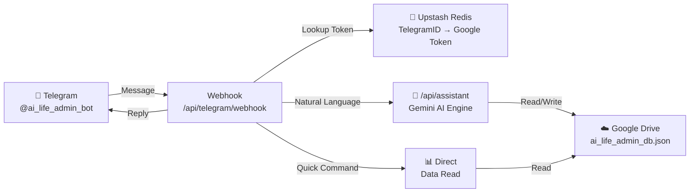
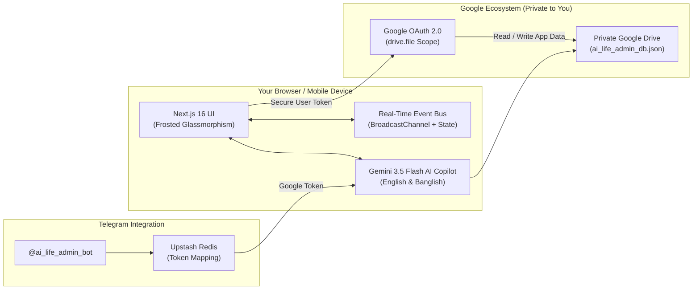

# 🌌 AI Life Admin — Personal Finance & Life Copilot

<div align="center">


<p align="center">
  <b>A privacy-first, intelligent personal life administration & financial copilot powered by Google Gemini.</b><br>
  Persistent memory, multi-wallet liquidity tracking, bilingual natural language accounting (English & Banglish),<br>
  predictive purchase stress-testing, and a full-featured <b>Telegram Bot</b> — with 100% data ownership hosted in your private Google Drive.
</p>

[Key Features](#-key-features) •
[Telegram Bot](#-telegram-bot-integration) •
[Architecture](#-architecture--privacy-model) •
[Bilingual AI Copilot](#-intelligent-copilot--persistent-memory-english--banglish) •
[Installation](#-getting-started) •
[Tech Stack](#-tech-stack)

</div>

---

## 💡 Overview

Managing modern life administration across scattered bank accounts, mobile financial services (bKash, Nagad), cash reserves, loans, subscriptions, and recurring commitments is fragmented and mentally taxing. Most personal finance tools either sell your data, lock your financial ledger in proprietary servers, or require tedious manual data entry.

**AI Life Admin** solves this by uniting **executive-level financial orchestration** with **private cloud storage** and a **Telegram Bot** you can use anywhere:
- **Zero-Knowledge Data Privacy**: Your financial records never sit on an unauthorized third-party database. All transactions, wallets, and debts are encrypted and saved straight to your personal **Google Drive** (`ai_life_admin_db.json`).
- **Intelligent Memory-Aware Copilot**: Add transactions, resolve complex follow-up questions using pronouns ("How much is in it?"), memorize personal rules, and execute tools using natural speech in **English** or **Banglish**.
- **Telegram Bot**: Log expenses, create wallets, track goals, and get financial summaries directly from your Telegram chat — powered by the same full AI assistant as the web app.

---

## ✨ Key Features

### 1. 📊 Executive Liquidity Cockpit (`/`)
- **Real-Time Net Worth & Reserves**: Live aggregation across liquid bank vaults, MFS accounts, cash, and investments.
- **Monthly Inflow vs. Burn Rate**: Real-time ratio analysis of earned income against variable spending.
- **AI Financial Diagnosis Modal**: Instant 1-click copilot audit analyzing cashflow health, liquidity runway, and urgent action items.
- **Recent Transaction Audit Log**: Filterable chronological feed of inflows, expenses, and inter-wallet fund transfers.

### 2. 💳 Multi-Wallet Liquidity Engine (`/money/wallets`)
- **Universal Wallet Support**: Track traditional Bank Accounts, Mobile Financial Services (bKash, Nagad, Upay, Rocket), Physical Cash, and Credit/Debit Cards.
- **Instant Inter-Wallet Transfers**: Move funds seamlessly between accounts with automated debit/credit balancing and timestamped transaction memos.
- **Zero-Leak Data Security**: When disconnected from Google Drive, defaults cleanly to a zero-state with zero demo-data contamination.

### 3. 🗓️ Monthly Planning & Calendar Matrix (`/money/planning`)
- **7-Day Dynamic Calendar Grid**: Visual matrix displaying upcoming daily financial obligations and payables.
- **Dual Perspectives**: Toggle between **Obligations** (*bills, loans due, subscriptions*) and **Daily Runway**.
- **Instant "Mark as Paid"**: Reconcile bills and payables with one tap, automatically logging the deduction to the selected source wallet.

### 4. 💸 Expense Burn Rate Manager (`/money/expenses`)
- **Executive Burn Cockpit**: Real-time monthly spend, daily burn velocity, top expenditure category, and AI classification coverage rate.
- **Visual Spending Distribution**: Interactive allocation bar mapping costs across Housing, Food & Dining, Utilities, Transport, Healthcare, and Shopping.

### 5. 💰 Income & Inflow Cockpit (`/money/income`)
- **Executive Inflow Metrics**: Track monthly earnings, all-time accumulated deposits, top revenue source, and recurring stream counters.
- **Dual View Modes**: Switch effortlessly between rich visual **Inflow Cards** and dense tabular **Inflow Sheets**.

### 6. 🤝 Loans & Debts Ledger (`/money/loans`)
- **Bidirectional Ledger**: Separate tracking for **Receivables** (*People Who Owe You*) and **Payables** (*Money You Owe Others*).
- **Repayment Drawer**: Step-by-step settlement history, partial payment logging, due date tracking, and debt status progression.

### 7. 🧠 Purchase AI Decision Engine (`/insights/recommendations`)
- **Pre-Purchase Financial Stress Testing**: Evaluate discretionary purchases (*e.g., iPhone, MacBook, vacation*) before tapping your card.
- **Multi-Dimensional Risk Analysis**: Audits liquid reserves, checks 14-day upcoming obligations, calculates runway erosion, and flags savings goal cannibalization.
- **Executive Reasoning Chain**: Delivers an unambiguous verdict (*Safe to Buy*, *Caution / Delay*, *High Risk*) backed by structured AI reasoning.

### 8. 🎯 Goals & Runway Forecasting (`/goals`)
- **Target Savings Milestones**: Set specific financial milestones (*Emergency Fund, Real Estate, Travel*) with live progress bars.
- **Runway Estimator**: Calculates how many months you can sustain current burn rate under zero income.

### 9. 📱 Full Multi-Device Responsiveness
- **Adaptive Screen Architecture**: Handcrafted layouts for smartphones (360px–430px), tablets (768px–1024px), and desktops (1280px+).
- **Persistent Mobile Top Header**: Sticky frosted glass navbar with 1-tap hamburger toggle, live cloud sync status, and AI copilot launcher.

---

## 🤖 Telegram Bot Integration

AI Life Admin includes a **full-featured Telegram Bot** that gives you complete feature parity with the web app — right from your chat. Powered by the same Gemini AI assistant, it can do everything the web app can.

### Setup
1. Search for **`@ai_life_admin_bot`** on Telegram and send `/start`
2. Open your web app → **Settings → Telegram Bot** in the sidebar
3. Click **"Generate Linking Code"** to get a 6-digit code
4. Send `/link YOUR_CODE` to the bot
5. You're connected! 🎉

### Quick Commands (Instant — No AI Processing)

| Command | Description |
|---------|-------------|
| `/summary` | Daily financial overview with today's spend + monthly stats |
| `/balance` | All wallet balances with types and total |
| `/expenses` | Last 5 expenses with category & date |
| `/goals` | Savings goals with visual progress bars |
| `/tasks` | Pending tasks sorted by priority |
| `/wallets` | All wallets overview |
| `/help` | Full command reference |

### Natural Language (Full AI Assistant)

Just talk naturally — the bot understands everything:

```
"spent 200 on groceries from bKash"
"create wallet IBBL bank with 10000 taka"
"transfer 500 from cash to bKash"
"add goal: save 50000 for laptop by December"
"add 2000 to my laptop goal"
"add task pay electricity bill by 20th"
"add Netflix 15 USD monthly subscription"
"I lent 1000 taka to Rahim"
"Rahim paid back 500"
"how much did I spend on food this month?"
"what's my financial summary?"
```

### Example Bot Responses

**`/goals`**
```
🎯 Savings Goals
━━━━━━━━━━━━━━━

🎯 Laptop Fund
   ▓▓▓▓▓░░░░░ 50%
   💰 25,000 / 50,000 BDT
   📅 By 31 Dec 2026
```

**`/summary`**
```
📊 Financial Summary
📅 16 September 2026
━━━━━━━━━━━━━━━

☀️ Today
💸 Spent: 50 BDT

📆 September
📈 Income: 30,000 BDT
📉 Expenses: 2,450 BDT
💼 Net: 27,550 BDT

🏦 Wallets Total
💰 35,200 BDT

📋 Pending
✅ Tasks: 3 • 📋 Bills: 1
```

### Architecture



### Environment Variables for Telegram

```env
TELEGRAM_BOT_TOKEN=your_bot_token_from_botfather
NEXTAUTH_URL=https://your-app.vercel.app
KV_REST_API_URL=https://your-upstash-url.upstash.io
KV_REST_API_TOKEN=your_upstash_token
KV_REST_API_READ_ONLY_TOKEN=your_upstash_readonly_token
```

---

## 🧠 Intelligent Copilot & Persistent Memory (English & Banglish)

The embedded AI Copilot has evolved from a stateless command executor into a **memory-aware, context-aware personal assistant**. It understands natural conversational input in both English and Banglish, remembers your personal preferences, and tracks conversation state just like a real human.

### 🌟 Memory & Context Features
- **Persistent Personal Facts**: The agent autonomously extracts and memorizes facts about your life (e.g., "My salary is 50k", "Never delete data without asking").
- **Pronoun & Entity Resolution**: You can use natural pronouns like "it", "he", or "that account". The agent tracks the active conversation topic and resolves entities flawlessly.
- **Privacy First (PII Rejection)**: Built-in regex safety validators automatically block sensitive data (PINs, Passwords, Card Numbers) from being stored in memory.
- **Memory Deduplication**: The system merges conflicting facts and boosts confidence scores for recurring statements instead of duplicating data.

### Example Prompts Supported:

| Category | Example Sequence | Action Executed by AI |
| :--- | :--- | :--- |
| **Memory & Tool Usage** | `"I opened a new City Bank account."`<br>`"Add 5000 tk to that account."` | Acknowledges the new account, then resolves "that account" to City Bank and adds 5000 tk. |
| **Entity Resolution** | `"Tanvir borrowed 1000 tk."`<br>`"He returned 500 tk today."` | Logs loan. Resolves "He" to Tanvir and updates the loan balance. |
| **State Persistence** | `"How much is in my bKash?"`<br>`"I spent 200 tk from it."` | Returns bKash balance. Resolves "it" to bKash and deducts 200 tk. |
| **Banglish Expense** | `"ami ajke 500 taka diye kachchi khasi khailam"` | Automatically logs ৳500 expense under **Food & Dining** with merchant "Kachchi". |
| **Banglish Planning** | `"agami 25 tarikh bari bhara 12000 taka dite hobe"` | Creates an obligation in **Monthly Planning** for House Rent due on the 25th. |
| **AI Stress Test** | `"Can I afford to buy a $1,500 gaming laptop right now?"` | Launches **Purchase AI Decision Engine** and stress-tests against 14-day liabilities. |

---

## 🔒 Architecture & Privacy Model

Unlike traditional SaaS personal finance applications, **AI Life Admin is designed with a Local-First, Cloud-Private architecture**.



1. **Direct Google Drive Integration**: When you authenticate with Google, the app requests access only to the files it creates (`drive.file` scope).
2. **Encrypted Cloud Sync**: Your data is read directly from your Google Drive on session start and synchronized back in real-time on every modification.
3. **Telegram Token Security**: The Telegram bot uses Upstash Redis to securely map your Telegram ID to your Google token. Tokens expire after 30 days.
4. **Clean Session Logout**: Logging out immediately purges authorization tokens, clears memory and `localStorage`, and reverts the UI to a pristine disconnected state without data leakage.

---

## 🛠️ Tech Stack

| Layer | Technology |
|-------|-----------|
| **Framework** | [Next.js 16 (App Router)](https://nextjs.org/) |
| **Core Library** | [React 19](https://react.dev/) |
| **Language** | [TypeScript 5](https://www.typescriptlang.org/) |
| **Styling** | Dark Frosted Glassmorphism · [Tailwind CSS v4](https://tailwindcss.com/) |
| **AI Model** | [Google Gemini 3.5 Flash](https://ai.google.dev/) |
| **Cloud Storage** | [Google Drive API v3](https://developers.google.com/drive) |
| **Authentication** | [@react-oauth/google](https://www.npmjs.com/package/@react-oauth/google) |
| **Telegram Bot** | [Telegram Bot API](https://core.telegram.org/bots/api) |
| **Token Store** | [Upstash Redis](https://upstash.com/) via [@upstash/redis](https://github.com/upstash/upstash-redis) |
| **Icons** | [Lucide React](https://lucide.dev/) |
| **Charts** | [Recharts](https://recharts.org/) |
| **Date Handling** | [date-fns](https://date-fns.org/) |

---

## 🚀 Getting Started

### 1. Prerequisites
- **Node.js**: `v18.18.0` or later (Node 20+ recommended)
- A **Google Cloud Console** project (Google Sign-In + Google Drive API)
- A **Google Gemini API Key** ([Google AI Studio](https://aistudio.google.com/))
- A **Telegram Bot Token** (from [@BotFather](https://t.me/BotFather))
- An **Upstash Redis** database ([upstash.com](https://upstash.com/)) — free tier works

### 2. Clone the Repository
```bash
git clone https://github.com/your-username/ai-life-admin.git
cd ai-life-admin/ai-life-admin
```

### 3. Install Dependencies
```bash
npm install
```

### 4. Configure Environment Variables
Create `.env.local` in the project root:

```env
# Google Gemini AI
GEMINI_API_KEY=your_gemini_api_key

# Google OAuth
NEXT_PUBLIC_GOOGLE_CLIENT_ID=your_client_id.apps.googleusercontent.com

# App
NEXT_PUBLIC_APP_NAME="AI Life Admin"
NEXTAUTH_URL=https://your-app.vercel.app  # or http://localhost:3000 for local dev

# Telegram Bot (from @BotFather)
TELEGRAM_BOT_TOKEN=your_telegram_bot_token

# Upstash Redis (from upstash.com)
KV_REST_API_URL=https://your-db.upstash.io
KV_REST_API_TOKEN=your_upstash_token
KV_REST_API_READ_ONLY_TOKEN=your_upstash_readonly_token
```

### 5. Register the Telegram Webhook

After deploying to Vercel (or using ngrok locally):

```bash
curl "https://api.telegram.org/bot<YOUR_BOT_TOKEN>/setWebhook?url=https://your-app.vercel.app/api/telegram/webhook"
```

### 6. Start the Development Server
```bash
npm run dev
```

Open [http://localhost:3000](http://localhost:3000) in your browser.

---

## 📦 Project Structure

```
ai-life-admin/
├── src/
│   ├── app/
│   │   ├── api/
│   │   │   ├── assistant/          # Gemini AI Copilot (all CRUD tools)
│   │   │   ├── telegram/
│   │   │   │   ├── webhook/        # Telegram bot webhook handler
│   │   │   │   └── link/          # Account linking API (generate codes)
│   │   │   ├── expenses/           # Expense CRUD
│   │   │   ├── income/             # Income CRUD
│   │   │   ├── wallets/            # Wallet management & transfers
│   │   │   ├── loans/              # Lending & borrowing ledger
│   │   │   ├── goals/              # Financial goals
│   │   │   ├── bills/              # Bill tracking
│   │   │   ├── tasks/              # Life admin tasks
│   │   │   └── planning/           # Monthly calendar matrix
│   │   ├── settings/telegram/      # Telegram linking UI page
│   │   ├── goals/                  # Savings goals page
│   │   ├── assistant/              # AI Assistant page
│   │   └── money/                  # Wallets, Expenses, Income, Loans, Planning
│   ├── components/
│   │   ├── layout/                 # Sidebar, MobileHeader, TopHeader
│   │   └── shared/                 # AIAssistantFloat, GoogleLoginButton
│   └── lib/
│       ├── ai/                     # Gemini AI engine, memory, chat
│       ├── drive-db.ts             # Google Drive sync & caching
│       ├── redis.ts                # Upstash Redis client & key helpers
│       ├── telegram-parser.ts      # AI-powered message parser (legacy)
│       ├── types.ts                # TypeScript interfaces
│       └── utils.ts                # Utilities & event bus
├── .env.local                      # Your local environment variables
└── package.json
```

---

## 🧪 Production Build

```bash
npm run build
npm run start
```

---

## 🎨 Design System

- **Canvas**: Midnight Obsidian (`#090D16`) with subtle cosmic gradients.
- **Glassmorphic Elevations**: Multi-layer frosted dark glass (`rgba(15, 23, 42, 0.72)`) with `backdrop-filter: blur(16px)`.
- **Semantics-Driven Glow Accents**:
  - 🟢 **Emerald (`#10B981`)**: Verified income, positive liquidity, safe verdicts.
  - 🔴 **Rose (`#F43F5E`)**: Outflow burn rate, overdue liabilities, high risk alerts.
  - 🟣 **Indigo (`#6366F1`)**: AI Copilot actions, reasoning logic, brand accents.
  - 🟡 **Amber (`#F59E0B`)**: 14-day upcoming obligations, cautionary thresholds.
  - 🔵 **Cyan (`#06B6D4`)**: Liquid balances, multi-wallet distribution.
  - 🔵 **Telegram Blue (`#229ED9`)**: Telegram bot integration UI.

---

## 🤝 Contributing

Contributions, issues, and feature requests are welcome!
1. Fork the project.
2. Create your feature branch (`git checkout -b feature/AmazingFeature`).
3. Commit your changes (`git commit -m 'Add some AmazingFeature'`).
4. Push to the branch (`git push origin feature/AmazingFeature`).
5. Open a Pull Request.

---

## 📜 License

Distributed under the **MIT License**. See `LICENSE` for more information.

---

<div align="center">
  <sub>Built with ❤️ using Next.js 16, Google Gemini, Google Drive, and Telegram Bot API.</sub>
</div>
